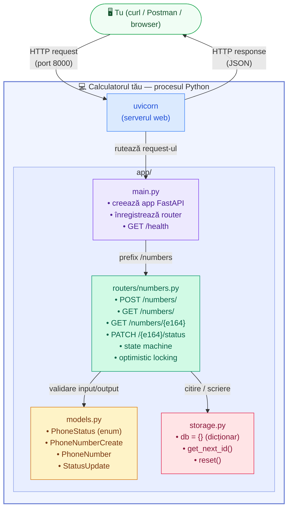

# Number Inventory Service — Arhitectura componentelor

Arată cum sunt legate fișierele proiectului și cum ajunge un request HTTP de la client până la stocare.



## Legendă

| Componentă | Fișier | Responsabilitate |
|---|---|---|
| uvicorn | — (server extern) | Ascultă pe portul 8000, primește conexiuni TCP |
| main.py | `app/main.py` | Punctul de intrare, înregistrează router-ul |
| Router | `app/routers/numbers.py` | Logica de business, state machine, locking |
| Models | `app/models.py` | Validare automată date (Pydantic) |
| Storage | `app/storage.py` | Dicționar Python ca bază de date temporară |
```