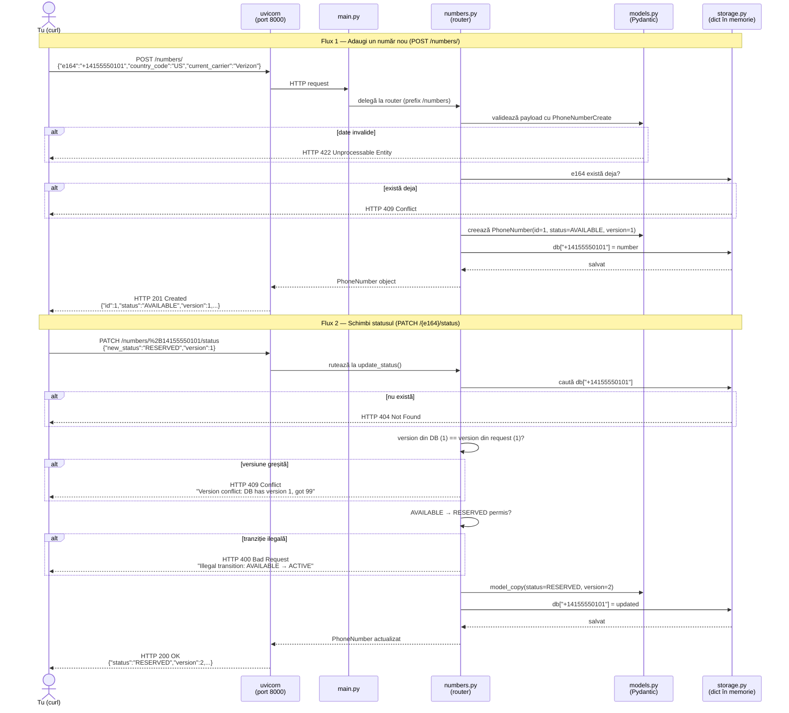

# Number Inventory Service — Fluxul unui request

Ce se întâmplă pas cu pas când trimiți `POST /numbers/` și `PATCH /{e164}/status`.

```mermaid
sequenceDiagram
    actor Tu as Tu (curl)
    participant UV as uvicorn<br/>(port 8000)
    participant MAIN as main.py
    participant ROUTER as numbers.py<br/>(router)
    participant MODELS as models.py<br/>(Pydantic)
    participant DB as storage.py<br/>(dict în memorie)

    Note over Tu,DB: Flux 1 — Adaugi un număr nou (POST /numbers/)

    Tu->>UV: POST /numbers/<br/>{"e164":"+14155550101","country_code":"US","current_carrier":"Verizon"}
    UV->>MAIN: HTTP request
    MAIN->>ROUTER: delegă la router (prefix /numbers)
    ROUTER->>MODELS: validează payload cu PhoneNumberCreate
    alt date invalide
        MODELS-->>Tu: HTTP 422 Unprocessable Entity
    end
    ROUTER->>DB: e164 există deja?
    alt există deja
        DB-->>Tu: HTTP 409 Conflict
    end
    ROUTER->>MODELS: creează PhoneNumber(id=1, status=AVAILABLE, version=1)
    ROUTER->>DB: db["+14155550101"] = number
    DB-->>ROUTER: salvat
    ROUTER-->>UV: PhoneNumber object
    UV-->>Tu: HTTP 201 Created<br/>{"id":1,"status":"AVAILABLE","version":1,...}

    Note over Tu,DB: Flux 2 — Schimbi statusul (PATCH /{e164}/status)

    Tu->>UV: PATCH /numbers/%2B14155550101/status<br/>{"new_status":"RESERVED","version":1}
    UV->>ROUTER: rutează la update_status()
    ROUTER->>DB: caută db["+14155550101"]
    alt nu există
        DB-->>Tu: HTTP 404 Not Found
    end
    ROUTER->>ROUTER: version din DB (1) == version din request (1)?
    alt versiune greșită
        ROUTER-->>Tu: HTTP 409 Conflict<br/>"Version conflict: DB has version 1, got 99"
    end
    ROUTER->>ROUTER: AVAILABLE → RESERVED permis?
    alt tranziție ilegală
        ROUTER-->>Tu: HTTP 400 Bad Request<br/>"Illegal transition: AVAILABLE → ACTIVE"
    end
    ROUTER->>MODELS: model_copy(status=RESERVED, version=2)
    ROUTER->>DB: db["+14155550101"] = updated
    DB-->>ROUTER: salvat
    ROUTER-->>UV: PhoneNumber actualizat
    UV-->>Tu: HTTP 200 OK<br/>{"status":"RESERVED","version":2,...}
```
